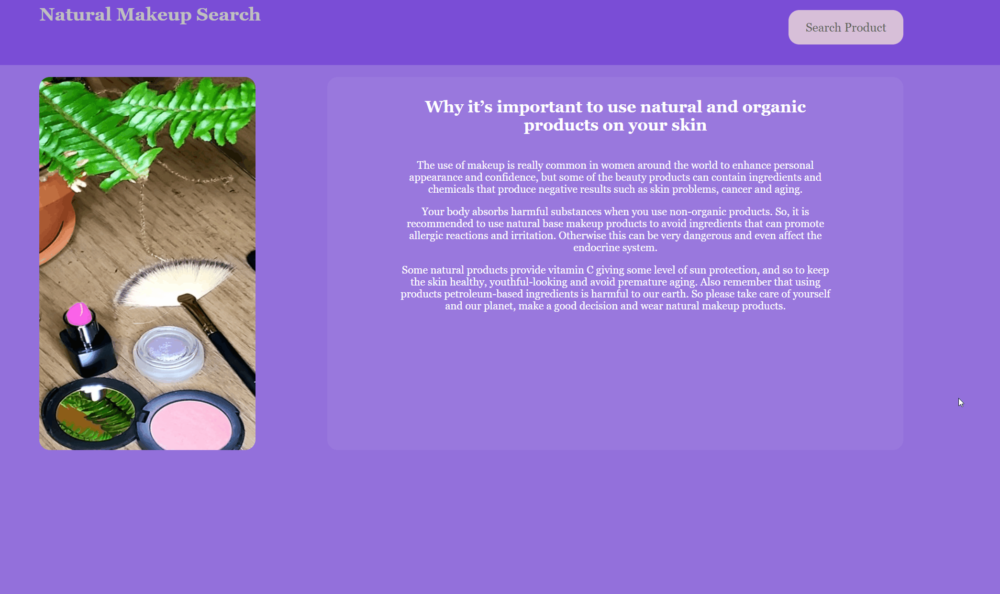
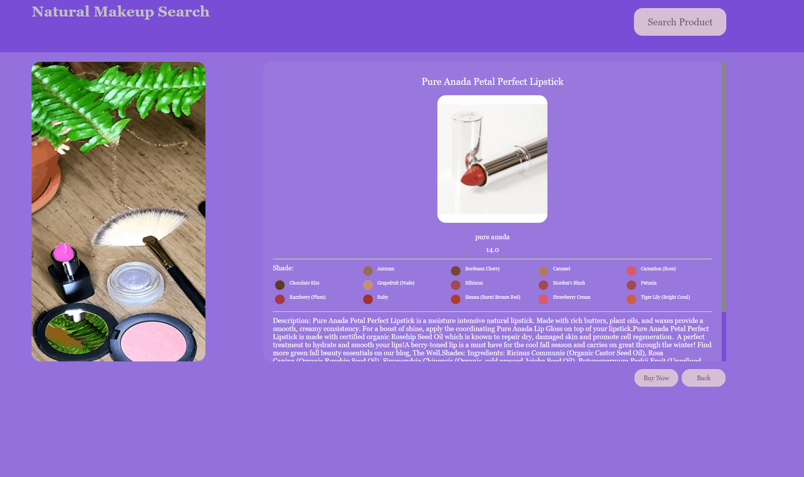

# Go Makeup

A dynamic web app that allows users to search for natural makeup products.

One of my hobbies is Makeup Artistry. I enjoy changing the appearance of people by using makeup and other accessories, and at the same time
is really important to take care of our skin and use quality products to avoid aging, cancer and other sking problems. For this
reason, I decided to create an app for users that love makeup to search for natural products, review their description, ingredients, shades and prices.
Users can also be redirected to an external website to purchase the products.

## Technologies Used

- HTML5
- CSS3
- JavaScript
- AJAX
- API
   - EndPoint: http://makeup-api.herokuapp.com/api/v1/products.json
   - Protocol: HTTPS
   - Method: GET
   - Response Format: json
- Figma

## Live Demo

Try the application live at [https://susana-gutierrez.github.io/go-makeup](https://susana-gutierrez.github.io/go-makeup)

## Features

- Users can see the importance of buying quality makeup products.
- Users can view products by type (Blush, Eyebrow, Eyeliner, Eyeshadow, Foundation, Lip Liner, Lipstick, Mascara).
- Users can view products by type and tags (Vegan, Gluten Free, Hypoallergenic, Organic, No Talc, Natural).
- Users can view products details.
- Users can be redirected to the product website and purchase it.

## Stretch Features

- Users can save favorite products.
- Users can share products in social media.

## Previous



## Getting Started

1. Clone the repository.

```shell
git clone git@github.com:Susana-Gutierrez/go-makeup.git
cd go-makeup
```

2. Review starter files given

```shell
ajax-project/
├── README.md
├── css
│   ├── layout.css
│   ├── reset.css
│   └── styles.css
├── index.html
├── js
│   ├── data.js
│   └── main.js
├── package-lock.json
└── package.json
```

3. Update given files as needed.
